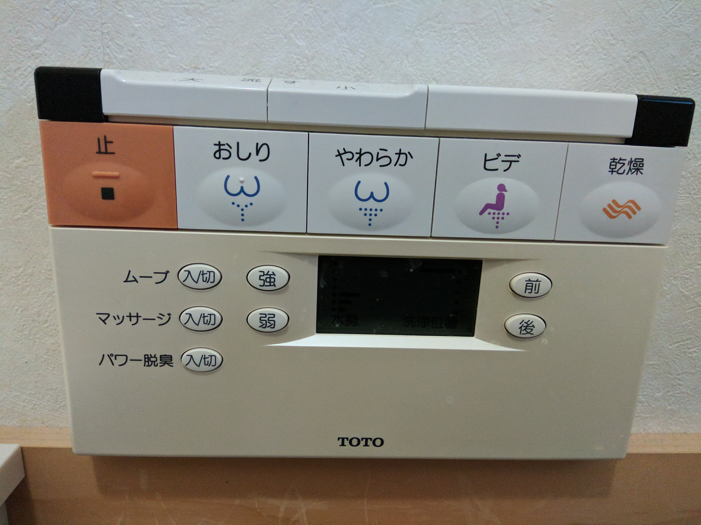
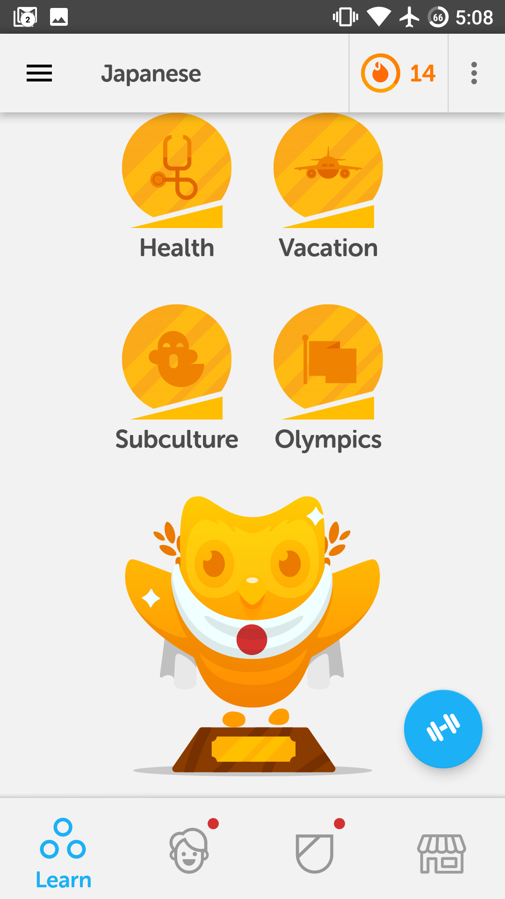
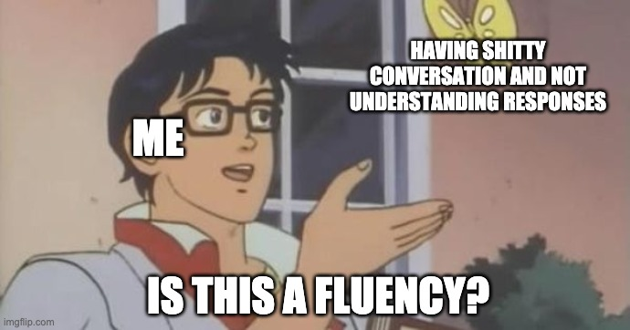

**I worked my ass off, I did everything I thought was right. I tried as hard as I could, and I didn't end up where I wanted to be. This is the story of my 2-year struggle with Japanese.**

## The beginning

I just want to preface that this post is not about discouraging anyone from studying Japanese and/or a second language. I just want to dispel some myths and help people set realistic expectations for themselves. I want to help the Japanese learning community sift through all the BS out there.

At the time of writing this post, it has been almost 3 years since I started studying Japanese and I still don't consider myself fluent. Let's start out with the definition of fluency from google -

> (of a person) able to express oneself easily and articulately.

I think the definition of fluency for everyone is different, but for myself, fluency meant the above definition but it also meant a lot more. It meant being able to do the things a normal Japanese person could do, like watching TV, listening to the radio, communicating with cashiers, understanding locals, being able to go on dates, and just overall, ease of **understanding** and speaking Japanese.

When I first moved to Japan I was a Snowboarding Instructor and lived up in Hokkaido in a little ski town called Niseko and initially had zero desire to learn Japanese, as I was totally surrounded by foreigners. I had the typical "why do I need to learn a second language if I can speak English" attitude.

 After about a month or two of living there, I started realizing how awesome Japanese sounded to me and how useful it could be to speak and read Japanese. I also thought about how cool would it be if I could learn what a "Spirit Bomb" was in Japanese. And every time I looked at some mysterious Japanese text it motivated me to start learning. And of course, it goes without saying as a young 25-year-old, immature male, 2 things in particular motivated me, anime and girls.

So after reading some Reddit posts, looking at all the cool language apps in the play store, and watching some youtube videos I said "fuck it, let's do this, how hard could this whole Japanese thing be?"

TLDR: 意外に難しかった、 harder than I imagined.

I started feeling inspired after watching some polyglot videos, one polyglot, in particular, caught my interest. He was some slightly overweight Irish fellow and he became fluent in Japanese in just 3 months! A lot of these so-called polyglot gurus and internet senseis said you could do it in about 6 months - 1 year IF you worked HARD. So I said, "God damn it, I'm a pretty resourceful guy and I live in Japan. If anyone can do it in 6 months to a year I can right?"

"... Right?"

## Stage 1 - Got Apps bro? and Pimsleur (0-3 months)

So about sometime in the middle of December, I started visiting the [reddit.com/r/learnjapanese](http://reddit.com/r/learnjapanese) subreddit like it was my religion. But I also saw the Instagram ads, the blog posts, the youtube videos, the paid advertisements. There were so many different ways and theories about how to learn Japanese.

I finally decided in this digital age the best way to learn a language was with **Apps**. So I downloaded them all, Duolingo, Lingodeer, Memorize, Anki, some Japanese dictionaries, and I started learning how to read hiragana (the simplest of the Japanese alphabets). At that time I had a friend who was able to _seemingly_ have decent conversation with locals from only using "Pimsleur" (listen and repeat, recorded Japanese lessons) for a few months before coming to Japan, and it seemed to have good reviews online, so I downloaded all of those lessons too.

I started only spending about ~30 minutes a day studying, but that quickly escalated to several hours a day. I was learning Hiragana, Katakana, then quickly moved on to the dreaded Kanji. I became obsessed pretty quickly. Unfortunately around this time, I hurt my shoulder on a failed backflip attempt on my snowboard (who knew that snow could get that hard-packed?) and it forced me into a semi-retirement from teaching snowboarding, which was great because now I could find a job where I study Japanese and Japanese culture full time!

So after about 2~3 months of using the apps and Pimsleur, I was better than all my other Gaijin friends, I had finished the Duolingo tree, I was done almost all of the Lingodeer lessons, I knew a few hundred kanji but I still nowhere close to being fluent. I couldn't understand what the store clerks were saying, I could only read the most basic of signs, I certainly could not hold a conversation unless it was about the most basic of things (weather, hello, hot, cold things like that).

 The thing that bothered me the most was that no matter how much grammar, vocab, kanji, and everything that I learned I could not understand pretty much ANYTHING that anyone said back to me. That pudgy Irish polyglot had deceived me... or maybe I didn't work hard enough? Or maybe this was being so-called "fluent"?

 

## Stage 2 - Genki and Anki, to infinity and beyond (3 months - 1 year)

I decided that being in Japan wasn't just enough, but to get a truly immersive environment I would need to move to the 田舎 aka the Japanese countryside. So I found myself a teaching English job at a mountain school in the middle of nowhere Japan and for the first little while, it was truly living the dream.

At this point in my Japanese journey, I still felt pretty good about my Japanese level, I was better than all my friends in Hokkaido and could start to read more and more. I was very much so, in relation to the Dunning-Kruger effect at the top of Mt. Stupid and god damn, I felt good.

I started my long, painful tumble from the top of Mt. Stupid very shortly after moving to my new village. After living and working with other Gaijin who were much more "fluent" in Japanese than me. The first realizations that not only was I nowhere near fluent, but my Japanese was in fact **horrible** was about the first or second day on the job when my Japanese co-worker took me around to 挨拶 (aisatsu) or greet all our Japanese neighbors. It was my first time hearing that word and the first thing I did was announce to all my coworkers that I was going 暗殺 (ansatsu) all my neighbors. Just a small pronunciation mistake but I had just announced to all of 15 coworkers that I was going to assassinate all of my neighbors ... Not the best first impression.

Also while in the midst of brutally assassinating ... I mean pleasantly greeting all neighbors, I had the awful realization couldn't understand anything of what was being spoken, **nothing**. It felt like being a floundering child lost in the middle of the ocean. I had finally arrived at the bottom of the Valley of Despair (maybe a place the Irish polyglot had not spent enough time learning to reach, perhaps?).

How could this be? I had used all the apps Reddit had recommended, I spent the time, I was learning the kanji maybe I knew about ~500 by then. What was wrong? Surely after 3 months, I should be able to understand something right!?

So I went back to the drawing board and tried to revise my study strategy to become fluent within the 1-year mark, surely that was more reasonable, right? This time I called upon the Reddit sensei's and cast out the internet blogging gurus (Sorry Benny but fuck you), and started consuming their beginner wiki like every word was the word of GOD himself. The result of my research from the holy father is as follows.

1. Thou shall buy the holy text "Genki" and study grammar every day.
2. Thou shall ONLY use Anki and forego the other sacrilegious apps (sorry Duolingo and others).
3. Thou shall learn to **read**.

Some other concepts Reddit told me taught me were, it is important to listen, read, speak, and do grammar study every day. So I really tried to focus on those things and tried to do as much as I could every day. My main study tools were Anki Core 6k deck, jōyō (常用漢字 - common usage kanji) deck, Italki lessons, and the Bibl... I mean Genki. A typical day would be as follows -

- 7 am-8 am, wake-up and do Anki ~ 1 hour, plus 15 new words a day, and 10 new kanji a day.
- 9 am- 3 pm, go to work, and try to listen to as much Japanese as possible from students, other teachers, etc.
- 4 pm - bedtime, study Genki, try to read manga, children's books, or watch some anime usually with English subtitles.

I would also try to do about 2 Italki lessons a week. I felt with all of this, I was listening, reading, talking, and studying grammar just about every day. And according to the gurus and the Reddit Senpai's I could become fluent in less than a year.

I would say the total active study time was 1~3 hours daily depending on the day. I was also doing my best to listen while at school, and consume Japanese media in Japanese as best as I could. I did my best to study, but I also did a lot of traveling, exploring and having fun.

This continued on for about 9 months and I was definitely making progress I was getting better I could start to have conversations (1-hour conversations with my Italki teachers), I could begin to understand some manga, I was finally beginning to be able to function in Japanese society. **But there was still so much I couldn't do.**

I couldn't buy a car or get my license without a translator, I couldn't understand anything in Keigo (polite Japanese speech), I couldn't understand 95 percent of what the kids were saying, I couldn't even answer the most basic questions asked by the local villagers, I would just smile and nod and walk away awkwardly. In hindsight, I should of もう一回ください-ed (one more time please) until they shooed me away.

But despite this, all of my coworkers were really astounded by how hard I was studying and how fast I was progressing. My reading ability was quickly exceeding my listening and speaking ability. Everyone around me was impressed, except for myself.

I felt like a 3-year-old, I couldn't express the ideas I wanted to express, I couldn't understand basic conversations between native speakers. If I had to say what my Japanese level was at the time, I would say my speaking and understanding level was that of a toddler, probably even worst because toddler's pronunciation and pitch accents and are really awesome.

## Stage 3 - JLPT N2 - the final frontier??? (1 - 1.5 years)

I wasn't fluent, I didn't feel fluent at all. I still struggled at so many things, but I was making good progress with the Reddit Sensei's study plan and I was sticking to my study schedule, but it was time to get serious. It has been a year and enough is enough, time to become get fluent.

The last thing that some of the online community claimed was equal to a basic fluency or even a business proficiency was - The Japanese Language Proficiency Test N2 (or JLPT N2 for short). For those of you who don't know what the JLPT N2 is, it's the second hardest Japanese language test in Japan for non-native speakers. I had been studying for just about a year, and most people claimed that getting to N2 level in a year to a year and a half was *possible* but very difficult. This was the last path (or shortcut) that I knew of, to become fluent in Japanese.

After doing my extensive Reddit research what I concluded that I needed to know and do, to pass the N2 was the following-

1. Learn around 6000 words.
2. Learn around 1000 N2 Kanji.
3. Finish at LEAST the grammar textbook Tobira.
4. Listen to as much Japanese as possible.
5. Read as much Japanese as possible.
6. Finish several N2 mock tests.

At this point, I knew about 3500 words (from my core 6k deck), and already knew about ~1000 Kanji (from the kanji deck), and was about halfway through Genki two. When I had crunched the numbers what I needed to do was learn ~500 words a month, 2 grammar chapters a week, and do as much listening and reading as I could do every day. If I did all these things for 5 months, *maybe* I could pass.

So after a week or two of debating whether to the N3 for a very likely pass or taking the N2 for a likely fail but at least a chance at getting some sort of recognized fluency certification, I wasn't sure what I wanted to do. But I had a coworker tell me that I would definitely fail if I took the N2 because he had failed it. For some reason a lot of Gaijin in Japan have this weird insecurity about their Japanese, and that their Japanese is better than everyone else's. It's really weird. Because my moronic coworker told me it was impossible, I HAD to prove that asshole wrong.

<!-- So I signed up for the N2. I had about 5 months to cram as much Japanese knowledge into my brain. I had my plan, I was ready. Many of the coworkers who had previously failed the JLPT N2 told me it was an impossible task to pass the N2 in such a short period of time and that added more fuel to the fire. I did what a called "rage studying" a level of zen that can only be achieved when trying to *"prove all the haters wrong"*. -->

Other advantages of taking the N2 was that it opened the door to more jobs, as its recognized in Japan as your Japanese being "good" or "serviceable", and I could start applying for jobs that had a Japanese requirement to them. The N2 could be my golden ticket to having a real life in Japan...

These next 5 months, I studied probably the hardest I ever did in my life. Every single Japanese word that was spoken at work I listened like they whispering the answer to the JLPT test questions themselves. I was using Anki so much I started to dream in flashcards. I was addicted to the sweet feeling of the green pie graph in my Anki statistics slowly filling up. I studied so much grammar that it would make my elementary school grammar nazi french teacher proud. Basically **every waking moment was studying Japanese**.

A couple of interesting Japanese study resources I found while studying were Nihongo Con Teppei - A Japanese Podcast for Intermediates, and the second was Matt vs Japan's Youtube channel. Before you say "this asshole I knew it, filthy AJATTer" hear me out.

When I first started listening to [Nihongo Con Teppei](http://teppeisensei.com/) I could hardly follow much of what he was saying, but if I listened and listened again, every subsequent listen I could pick up more and more. This was the one resource that I truly felt improved my Japanese more than anything else in terms of speaking and understanding casual Japanese. I can not recommend this podcast enough to low intermediates all the way to lower advanced learners. **THIS PODCAST HELPED ME COMMUNICATE IN JAPANESE MORE THAN ANYTHING ELSE**. In terms of time spent listening to real-life results with my Japanese, nothing else that I used to study compares. ありがとうございました, 鉄平先生！

The second resource is Matt's channel, and up until this point I had laughed in the face of the Ajatt-ers because I was living the real AJATT (All Japanese All The Time). However, A few things he said really changed my whole perspective on studying Japanese. The first was that you could become fluent in Japanese without speaking a word, which basically means your Japanese level is a function of your input NOT your output. The second was that the process to become *truly* fluent, not Benny fucking... I mean snake oil salesman fluent, was actually around 3-4 years, at the bare minimum.

And Teppei Sensei was saying the almost same thing. His perspective was almost the exact same at Matt's. A very simple message "you want to be fluent in Japanese?" The answer "Just listen". That's it. So simple but it blew my mind. These were people who were very fluent in their target language, people who dedicated a big portion of their lives to language learning. Here I was practicing Kanji, reading manga, doing grammar exercises, listening to people explain Japanese concepts in English. But I had neglected the most important thing - listening to Japanese.

Sure I was listening to Japanese at work and through out the day, but I wasn't listening to anything really comprehensible or aimed at beginners or intermediates. I was either listening to kids talk about nonsense or was listening to full blown Japanese-to-Japanese Keigo office speak.

After having this revelation, I didn't really change the way I studied Japanese because my current daily study routine was optimized to crush the JLPT N2, and 5 months later I did just that. I scored 112/160 a solid pass. I had done the impossible (well at the least the improbable). I did what the Reddit Senseis, the internet gurus, the online community told me what it took to become fluent. Can you guess if I was finally fluent? Short answer - nope.

Long answer - I could read basic articles, I could hold basic conversations, I could finally start to understand the world around me, I could do *almost* everything on my own without a translator. I could live in this Japanese world and function. But I still sucked, I still had to concentrate with the force as Piccolo firing a special beam cannon every time I listened to someone speak, I couldn't understand native Japanese people speaking to each other, it took me 10x longer to read something than a Japanese person. This was fluent? Surely no one would consider this fluent? If I were to compare myself to a child, I was about a 4-year-old in terms of listening and about a 8-year-old in terms of reading. Maybe not even that.

## Stage 4 - Okinawa - the final-est frontier!?!? (1.5 - ~2 years)

After all this JLPT stuff. I was tired of my job and not sure about my life in Japan, whether I wanted to make this my home or not, and decided it was time to go home and regroup, but not before one final hurray in Okinawa and finish the rest of the time left on my visa.

Up until this point, I feel like I worked just about as hard as one can in a year and a half's time. Even though my study tactics had not been perfect I had still put in the time and I think I had it figured out now. I needed to be in an environment with **no english**. So I decided the best place for my study-cation was the island of Ishigaki.

This time 100% I was going to be fluent or at least damn close. The new study plan was to listen to as much Japanese as possible, sentence mining (creating Anki cards from anime or tv shows), and reading at least an hour every day. And the best job to achieve all of this was a Hostel (well frankly the only job a Gaijin could get down there).

So I started my job and my average day went as follows.

- Wake up at 9 am
- Clean hostel until around 12 o'clock while listening to Japanese podcasts or anime or some audio. (3 hours listening)
- Either go to the gym, beach or watch anime in my room (2 - 3 hours)
- Return to hostel cook dinner, get drunk, and converse with guests and locals.

Some days I would read a bit more, some days I would watch anime all day, some days I would go out with Japanese friends. The ONE consistent thing I did was **all Japanese all day**.

I was super motivated at this point I had already decided to head back home after Okinawa to figure life out and decide if I really want to live in Japan or not. I was determined to not let these months go to waste, I wanted to be fluent no matter what.

The time flew by and the studying was fun and easy. I made great relationships with the guests and the staff there. I accomplished my 2-year long dream of going on dates completely in Japanese (but if you really just go for it, you can probably do this after a month, but have fun basically communicating like a grunting ape and talking about stuff you like and don't like). I had accomplished almost everything I had set out to do and more.

I was ready to leave, but I wasn't satisfied. I had done everything I could, but it wasn't enough. I still wasn't fluent.

To me being fluent is being able to have a conversation and not fear they throw a word in there you don't understand and you look like a moron. Fluent is being asked a question and being able to answer the question without rehearsing the line in your head a 1000 times. Fluent is being able to follow native conversations without straining so hard you think you are having a brain aneurism. Fluent is not stopping yourself before you say something because you have NO IDEA how to say or explain it. Fluent is not wondering if what you just said made any sense at all, as everyone stares at you blankly. These were all problems and challenges I would face **daily** at the end of my time in Okinawa. The definition of fluent is different for everyone, but for me, it was all those things and I wasn't fluent.

This led me to 2 possible conclusions.

1. I suck at language learning.
2. What I set out to achieve wasn't realistic in the first place.

I think the answer to that question now is a little bit of both.

## Stage 5 - 本当に最後があるのかよ!? This is taking forever

I felt at the end of my time in Ishigaki that *finally*, I was getting there. Finally, I could see measurable progress. I felt that maybe an additional 1 year of living there would have gotten me to some decent level of fluency where I could honestly say that I was fluent without feeling like a fraud.

I like to think learning Japanese is like playing a RPG. Every step of the way, every level up, you get new skills, new powers, new equipment, and god damn it is so awesome. But just like RPG's, it takes longer to level up the higher you get, you might even wondering if you are even gaining any experience points. And of course, there is the last boss - The fearsome chatterbox old man at the onsen (hot spring), where you are butt-naked, defenseless, and you have no idea what the actual fuck this man is saying and you just smile and nod.

So after everything here is my list of cold hard Japanese learning truths that I learned on this long journey.

1. Apps, textbooks, language games, tests etc. are not going to get you fluent or even close. They can help you along the way, but no one ever became fluent in a language with just apps, but lots of people become fluent without them.
2. Don't believe anyone who gives you those ridiculously short estimates about how long it takes to learn Japanese.
3. Only one thing will make you fluent, time.

Learning Japanese has been one of the most rewarding and life-changing journeys of my life, it had its highs and lows. The best part about learning Japanese is that Japanese people are so damn nice and encouraging they will cheer you on the whole way (with some exceptions) and you will feel so happy you started.

The goal of this post was not to dissuade anyone from starting, but to help people set realistic expectations when starting and hopefully help choose the study method that best aligns with their goals.

I had done 1000's of hours of studying, I tried my best, I did everything I possibly could to get to that goal of fluency in under 2 years but I felt disappointed at the end. I had failed or at least it felt like I failed. But truthful I think the only thing I failed at was picking a reasonable goal at the start. After all that studying, trying every resource in the book, doing everything the best way I could, I got nowhere near fluent in two years. I think that my case is not the exception but more close to the rule.

If I could do it all over again I would skip the apps, skip the Pimsleur, skip everything, except Genki textbooks, Anki, and heavy immersion from day one. Now if I did all this right, would I have been fluent by the two-year mark? For me, I think the answer is 'no', but I would have gotten much closer.

But in the end, I was able to do a lot of what I set out to do. I went on dates, I talked with the locals, had unique, life-changing experiences that most Gaijin will never have, I learned how to watch anime with no english subtitles, I learned how to read japanese manga and novels, I learned the Japanese word for Spirit Bomb (元気玉くらえ!!!) but most importantly I learned you can't fucking be fluent in Japanese in under 2 years. But don't let that stop you from trying!

Let me know about your Japanese story! Did you become super fluent in 2 years? Do I just suck? Let me know in the comments below.
